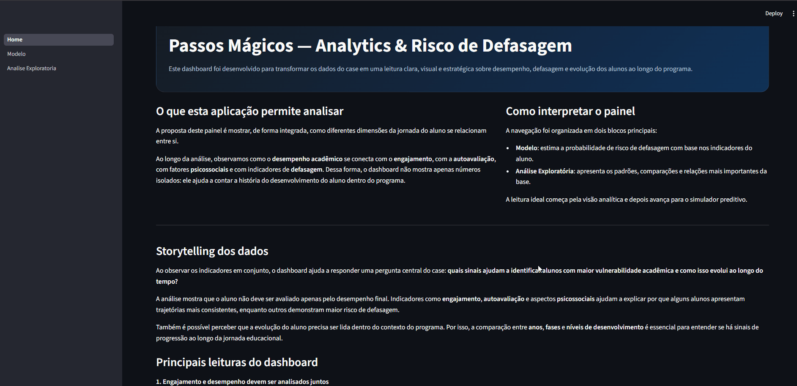
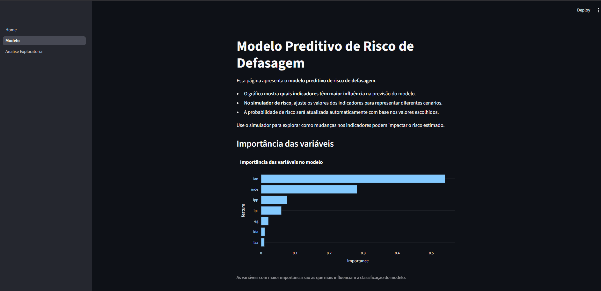

# FIAP Tech Challenge 5
# Dashboard Analítico e Modelo Preditivo — Passos Mágicos

Projeto desenvolvido para o **FIAP Tech Challenge 5**, baseado no case da **Associação Passos Mágicos**, organização que atua há mais de 30 anos promovendo transformação social através da educação.

A solução proposta combina **análise de dados, machine learning e visualização interativa**, com o objetivo de **identificar e prever o risco de defasagem escolar entre alunos atendidos pelo programa**.

---

# Problema de negócio

Programas educacionais voltados para populações em vulnerabilidade social enfrentam um grande desafio:

**identificar precocemente alunos com risco de atraso educacional.**

Sem mecanismos de análise de dados, esse acompanhamento depende apenas de observação manual, o que dificulta:

- priorização de alunos em risco
- identificação de fatores que impactam desempenho
- avaliação da efetividade do programa ao longo do tempo

Este projeto busca responder:

- quais fatores influenciam o desempenho dos alunos?
- é possível prever risco de defasagem?
- como os indicadores educacionais evoluem ao longo do tempo?
- existem sinais de impacto positivo do programa?

---

# Objetivos do projeto

A solução foi construída com três pilares principais:

### 1️⃣ Análise exploratória de dados

Investigar os indicadores educacionais para identificar padrões e relações relevantes.

### 2️⃣ Modelo preditivo

Treinar um modelo de machine learning capaz de **estimar a probabilidade de um aluno entrar em risco de defasagem**.

### 3️⃣ Dashboard interativo

Criar uma aplicação em **Streamlit** que permita explorar os dados e simular cenários de risco.

---

# Arquitetura da solução

Fluxo do projeto:

Dados → Tratamento → Feature Engineering → Modelo → Dashboard → Simulador de risco

---
## Demonstração da aplicação

### Home


### Dashboard analítico
 


### Modelo preditivo


# Estrutura do projeto 


```
FIAP-TECH-CHALLENGER-5
│
├── app
│   ├── Home.py
│   ├── pages
│   │   ├── 1_Modelo.py
│   │   └── 2_Analise_Exploratoria.py
│   │
│   └── utils
│       ├── loaders.py
│       └── charts.py
│
├── data
│   └── processed
│       ├── base_unificada.csv
│       └── diagnostico_base.json
│
├── models
│   ├── modelo_risco_defasagem.joblib
│   └── metricas_modelo.json
│
├── notebooks
│   ├── 01_EDA_Passos_Magicos.ipynb
│   └── 02_Modelo_Risco_Defasagem.ipynb
├── scripts
│   ├── data_loader.py
│   └── preprocess.py
│
└── README.md
```

---

# Indicadores utilizados

| Indicador | Descrição |
|---|---|
| IDA | Indicador de desempenho acadêmico |
| IEG | Indicador de engajamento |
| IAA | Indicador de autoavaliação |
| IPS | Indicador psicossocial |
| IPP | Indicador psicopedagógico |
| IAN | Indicador de adequação de nível |
| INDE | Indicador de desenvolvimento educacional |

---

# Definição do risco de defasagem

A variável alvo utilizada no modelo foi definida como:

```
risco_defasagem = 1 se defasagem < 0
```

Fallbacks utilizados:

- `defas < 0`
- aproximação por `ian <= 5`

Essa regra representa alunos que estão **abaixo da fase esperada para seu nível educacional**.

---

# Modelo de Machine Learning

Modelo supervisionado para classificar alunos em:

```
0 → sem risco
1 → em risco de defasagem
```

### Features utilizadas

- IDA
- IEG
- IPS
- IPP
- IAA
- IAN
- INDE

---

# Resultados do modelo

| Métrica | Resultado |
|---|---|
Accuracy | ~0.978 |
Precision | 1.00 |
Recall | ~0.953 |
F1 Score | ~0.976 |
ROC AUC | 1.0 |

Esses resultados indicam **alta capacidade do modelo em identificar alunos em risco**.

---

# Dashboard interativo

O dashboard foi desenvolvido em **Streamlit** e possui três seções principais:

### Home
Resumo executivo e contextualização do projeto.

### Análise exploratória
Visualizações analíticas e interpretação dos indicadores educacionais.

### Modelo
Métricas do modelo, importância das variáveis e simulador de risco.

---

# Simulador de risco

O simulador permite alterar os indicadores educacionais e calcular:

```
probabilidade estimada de risco de defasagem
```

Isso permite **simular cenários e entender como os indicadores influenciam o risco educacional**.

---

# Insights obtidos

- engajamento está associado ao desempenho acadêmico
- fatores psicossociais influenciam evolução educacional
- alunos em fases avançadas tendem a apresentar maior desenvolvimento
- risco de defasagem apresentou queda ao longo dos anos

---

# Como executar o projeto

Instalar dependências:

```
pip install -r requirements.txt
```

Executar o dashboard:

```
streamlit run app/Home.py
```

